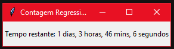

<div align="center">
  <h1>Timer ⏱️</h1>
</div>

# Sobre
O intuito deste projeto é gerar na tela um timer de contagem regressiva, com o tempo relativo a conversão de um número inteiro total que represente os segundos. Esse projeto é útil pra mim para controlar visivelmente a execução dos meus códigos, principalmente projetos que envolvam automação. 
</br>
<div  align="center"></div>

# Requisitos
Linguagem:
- [Python 3](https://www.python.org/)<br></br>

Bibliotecas e tecnologias:
- [Tkinter](https://tkdocs.com/)
- [time](https://docs.python.org/3/library/time.html)

# Como instalar:
Clone o projeto para o seu computador
```bash
$ git clone https://github.com/hyskoniho/countdown-timer
```
</br>

Instale as bibliotecas necessárias<br></br>
No Windows:
```bash
pip install tkinter
```
No Linux/MacOS:
```bash
pip3 install tkinter
```

# Adicione o timer a um projeto existente:

Primeiro, importe a biblioteca _subprocess_:
```bash
import subprocess
```
Depois, adicione o arquivo *timer.py* ao diretório do seu projeto
Em seguida, insira a seguinte linha de código:
```bash
subprocess.run(['python', 'timer.py'], input=str(valor), text=True)
```
(lembre-se de alterar o nome "valor" para a sua variável ou número de segundos para o timer!)
